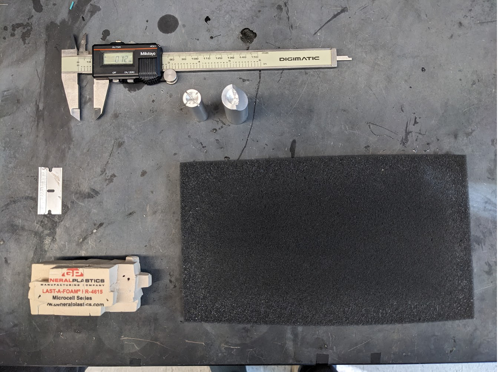
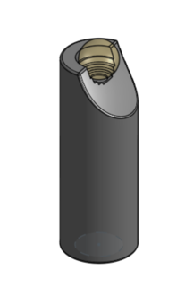
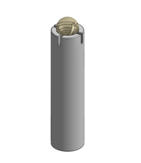

Treadmill Ball Grinders
===

**In progress: versioned documentation for ease of sharing.**

## Spherical Treadmill Fabrication

### Materials

* Foam - FR-4615 from General plastics
* Razor blade
* 'Coarse' and 'fine' foam sphere grinders
* Calipers capable of tenths of milimeters
* Soft foam pad
* Ball holder and air regulator
* Black paint or a paint pen (optional)
* Snugly fitting gloves (optional)
* Face mask (optional)

### Notes
* Wearing gloves can be helpful to avoid pressing oils from your fingers into the ball, which make the ball harder to grind.
* Wear a face mask to avoid breathing in the dust as you grind, and wipe up excess foam afterwards.

### Fabrication Steps
1. **Cut a cube foam starting matrial.** Cut a cube (carefully) of the FR-4615 foam that is around ~11mm on each side using a razor blade.
	* It can be helpful to mark out the edges with a fine-tipped marker first, then cut into them (the marks will be ground away before the end).
1. **Trim the cube of foam.** Using the razor blade, trim down the sharp edges and corners of the cube to make it more spherical (e.g. the way you might peel a grapefruit's skin). 
	* Doing more of this trimming into a spherical shape here will make the next step easier. You should get a sense for it as you try the next step if you’ve done enough.
1. **Begin grinding the trimmed cube.** Place the trimmed material into the coarse (bigger) grinder that has a diameter of ~11.5 mm and start grinding down the cube. To do this:
	* Place the ball in the “cup" of the grinder and then grind it down by rolling it “away” from you with your thumb and forefinger. Apply enough force for the grooves in the cup to cut away the edges of the ball.
	* The initial grinds as the cube molds into a sphere require more force, and you will notice big chunks chipping off the foam.
	* You can roll it a bit to remove material, then take it out, rotate it a bit, and do it again on another face. It will eventually become much easier to move as it becomes more sphere-like. 
	* As the cube transforms into a sphere, use gentle force to avoid big chips that can leave deep dents or compress the foam.
	* Continue massaging the ball into the metal grinder while continuously moving the ball around to allow for all surfaces to get shaved down evenly. Keep doing this until hardly any material is being taken away and the ball appears smooth.
	* You’ll need to periodically knock the dust out of the grinder, so it ends up being: roll a bit, knock out the dust, rotate ball position, roll a bit… and so on.
1. **Grind the sphere to near its target size.** Move to the smaller spherical grinder when the ball is ~9.2 mm diameter and fits into the fine (smaller) grinder. 
	* Continue massaging the ball to allow for even shaving across the entire surface of the sphere. 
	* When the ball is close to its final size, switch to rolling the ball around on the surface of the soft foam pad. Keep the ball secured in the metal grinder, but be careful, the ball may jump off the foam. Note this step is to help ensure the ball finishes with very even shaving.
1. **Test ball performance as you finish grinding**. As the ball gets closer to 9mm start putting the ball on the ball holder with ~50-100mL/min of air and watching its behavior. 
	* The final diameter of the ball is ~9mm, _but we recommend starting to test when it is slightly larger to avoid overshooting._ 
	* Guidelines for what to look for when the ball is levitating on the air cushion:
		* The ball should fit snugly in the ball holder and bob gently.
		* The ball should not wobble from side to side, this indicates the ball is too small.
		* The ball should spin freely in circles when nudged with a feather, this indicates there is no friction from the holder.
	* The ball might pass all the check points, but ultimately the flies must decide if they like it or not.
1. **(optional) Add markings to the ball for tracking** Once the ball is the final desired size, use the black acrylic paint or paint pen to mark the surface of the ball for behavioral tracking (e.g. a camera and FicTrac)
	* Ensure that every view angle of the ball has a unique pattern on it.
	* Numbers and letters are generally good, or spots of different sizes and shapes. 
	* Sharpie will also work for marking the ball but will have much less contrast under IR compared to the black paint. 
	* NOTE: if you grind the ball down after applying the markings, you will smear them and reduce the contrast.

## Grinders

### Grinder Fabrication

There are two components to be machined, a 'fine' and 'coarse' grinder. They were made to be CNC machined with a lathe. So far they have been outsourced to Protolabs with good results. Using Aluminum 6061-T651 with "Edges broken (tool marks visible)” works well.

It is possible they’d work as 3D printed plastic (at reduced cost) but this has not yet been tested.

